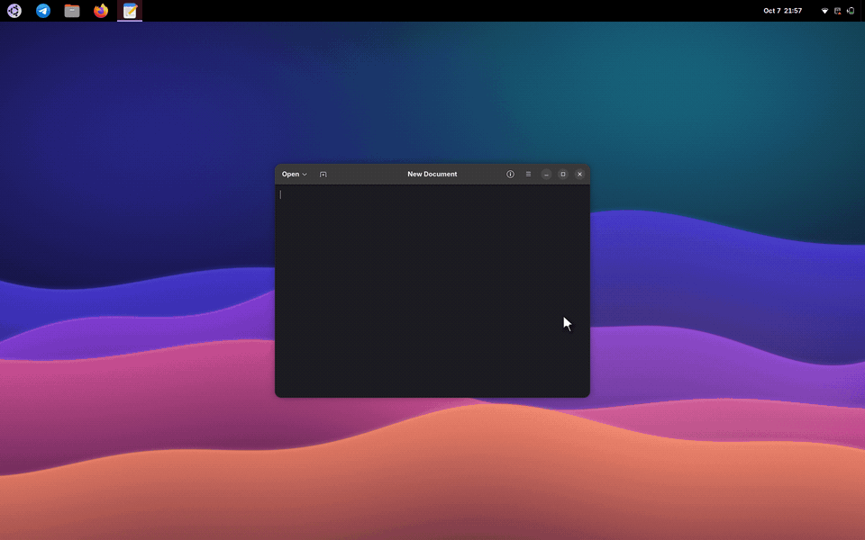
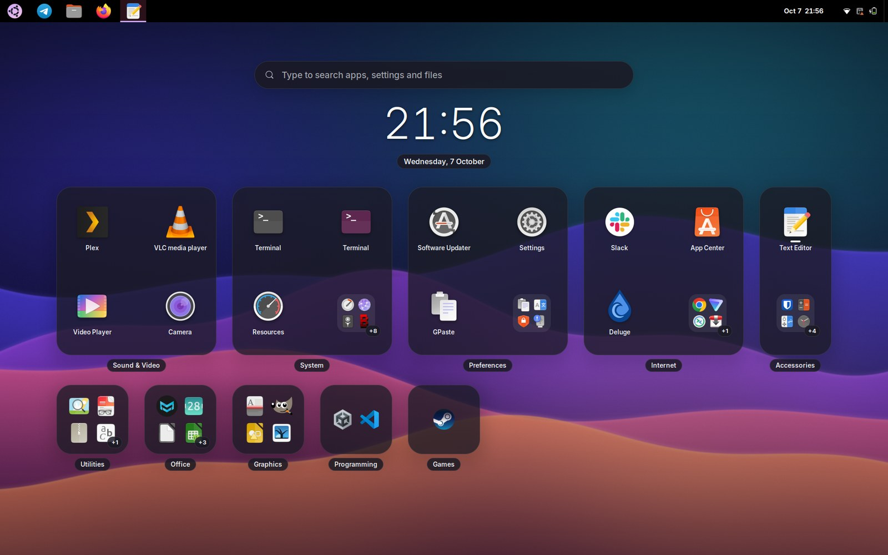
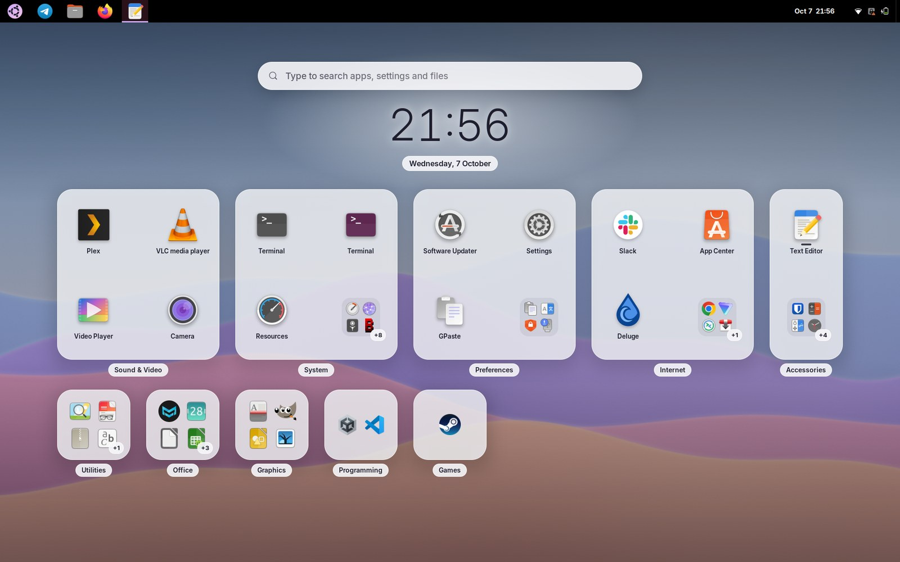
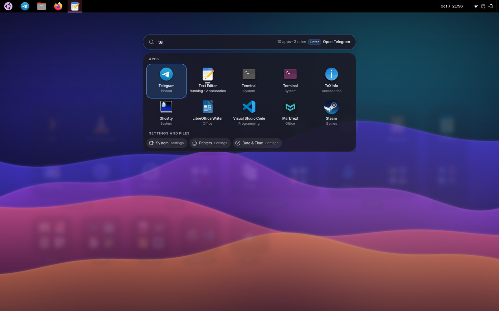
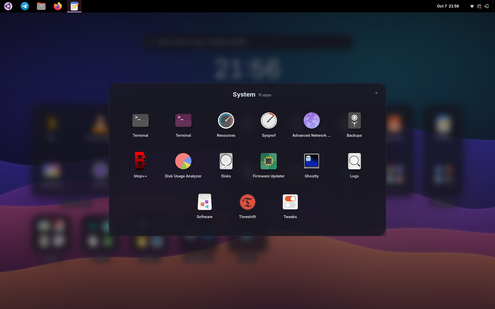
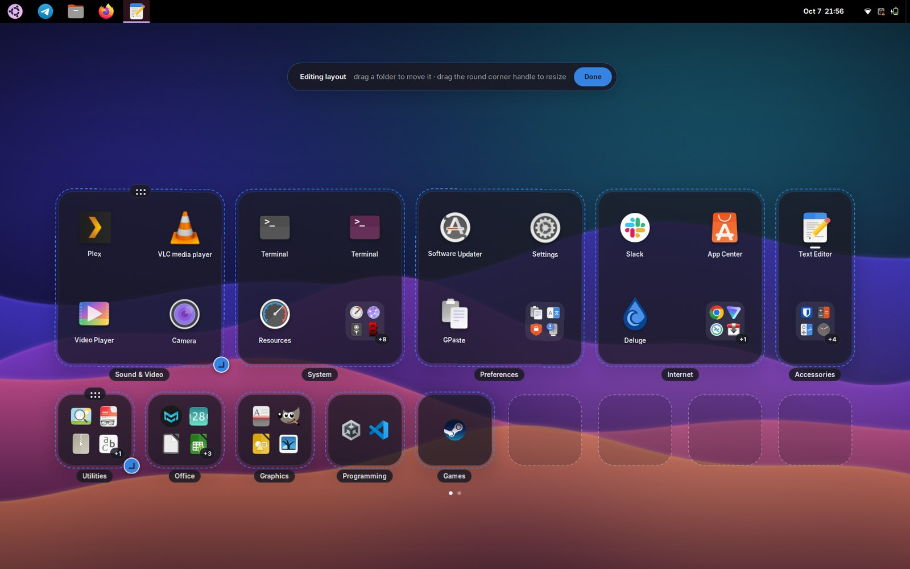
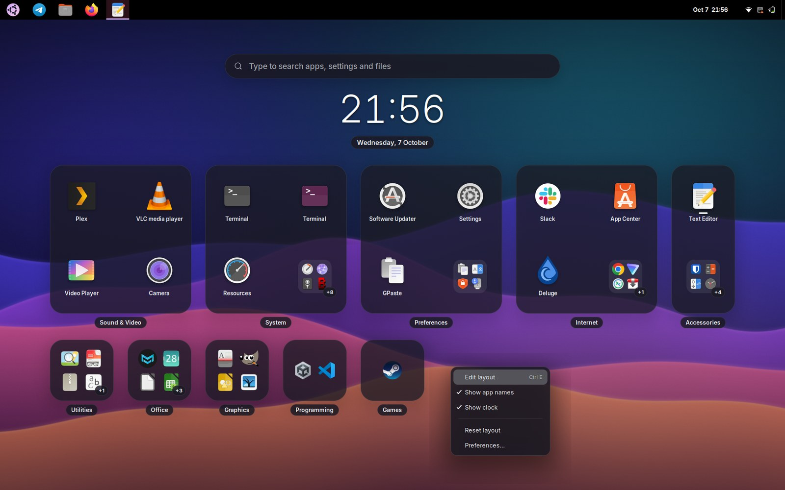

# Cubby

A home screen for GNOME Shell. Cubby replaces the Show Apps grid with your app folders as glass tiles that you place and size yourself on a grid, like the home screen on a phone. Each tile shows its most used apps as big icons, and the rest as a small preview with a "+N" count. A search field on top finds apps, settings and files.

Only Show Apps changes. The Activities overview, window picker and workspaces stay as they are.



| Dark | Light |
|---|---|
|  |  |
| **Search** | **Folder** |
|  |  |
| **Edit layout** | **Right-click menu** |
|  |  |

## What it does

- **Your folders, your layout.** Tiles are your app folders (from GNOME's own app-folder settings, which the extension only reads). Apps in no folder go to an "Unsorted" tile. If you never made folders, apps are grouped by category instead. The first layout is generated from how much you use each folder; after that, tiles stay where you put them.
- **Tiles from 1×1 to 4×3.** The most used apps get big icons with names; the rest show as a 2×2 preview with a "+N" for the apps you can't see. Running apps get a small bar under the icon, one mark per window.
- **Search.** Start typing anywhere. Apps come first, ranked like GNOME's own search; settings, files and anything else from your enabled search providers follow. The field tells you what Enter will do ("Switch to Telegram").
- **Folders.** Click a tile's preview or its name to grow the tile into a panel with every app in it. Drag apps to put them in your own order; the tile shows them in that order too. "Sort by use" puts it back.
- **Edit mode.** Right-click and choose Edit layout, long-press a tile, or press Ctrl+E. Drag a tile to move it, drag its round corner handle to resize it. Each screen size keeps its own arrangement.
- **Keyboard first.** Arrows move between icons, previews and tiles; Tab cycles; Enter opens; Esc steps back one level.
- **Fits the screen.** The grid is worked out from your screen's work area, so it adapts to small laptops, docks on the side, 4K at 200% and ultrawides. Extra tiles go to further pages.
- **Looks right on any wallpaper.** The background darkens more on bright wallpapers. The accent follows your system accent colour (or a colour you pick), and the style follows light and dark mode. Every text style was checked for at least 4.5:1 contrast on five quite different wallpapers.

## Requirements

GNOME Shell 50. Works with the stock dash, Ubuntu Dock and Dash to Panel; their Show Apps buttons open Cubby.

## Install

From a release zip:

```sh
gnome-extensions install --force cubby@y0av.github.io.shell-extension.zip
```

Log out and back in (GNOME on Wayland loads new extensions at login), then:

```sh
gnome-extensions enable cubby@y0av.github.io
```

## Use

| | |
|---|---|
| Open or close | Super+A, or any Show Apps button |
| Search | Start typing. Backspace edits, Esc clears |
| Move around | Arrows, Tab and Shift+Tab |
| Open | Enter, or click. Ctrl+Enter opens a new window |
| Folder | Click a tile's preview or name; Esc closes |
| Reorder apps in a folder | Drag them, or Alt+arrows on the focused app |
| App menu | Right-click an app (or press the Menu key): New Window, the app's own actions, Pin, App Details, Quit |
| Edit layout | Right-click → Edit layout, long-press a tile, or Ctrl+E |
| Move or resize a tile | Drag it, or drag its round corner handle. With the keyboard: arrows move, Shift+arrows resize |
| Leave | Esc steps back: menu, edit mode, folder, search, then closes |

## Preferences

Open them from the right-click menu or the Extensions app.

- Show app names
- Show clock (a large clock and the date under the search field)
- Frosted glass (a blurred copy of the wallpaper inside the tiles)
- Custom accent colour
- Use the stock app grid instead (turns Cubby off without disabling the extension)
- Reset layout

## Privacy and your settings

The extension reads your app folders, favourites and app usage from GNOME's settings and never writes to them. Its own layout, generated groups and preferences live in its own settings (`org.gnome.shell.extensions.cubby`). The extension itself makes no network requests.

## Development

```sh
tools/build.sh                 # pack dist/cubby@y0av.github.io.shell-extension.zip
gjs -m tests/test-layout.js    # unit tests for packing, reflow, overflow counts, navigation
npx eslint                     # code style
tools/lint.sh                  # shexli, the extensions.gnome.org review linter
tools/nest.sh start 1920x1200 --dtp   # isolated headless GNOME Shell with the extension
tools/walkthrough.sh           # scripted walkthrough against it
```

`tools/nest.sh` runs a separate headless GNOME Shell with its own settings database, so testing never touches your session. The other `tools/test-*.sh` scripts run against it. `DECISIONS.md` describes how Cubby hooks into the shell, which private shell API it depends on, and why things are done the way they are.

## License

GPL-2.0-or-later. See `COPYING`.
